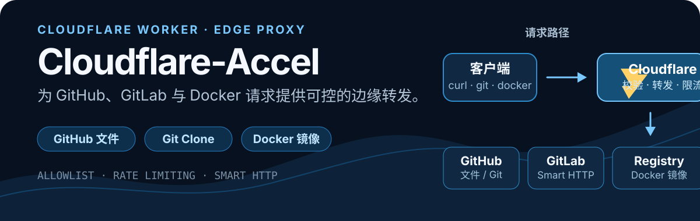

<p align="center">
  
</p>

<p align="center">
  <a href="./LICENSE"></a>
  
  
</p>

# Cloudflare-Accel

一个部署在 **Cloudflare Workers** 上的受控反向代理，用于转换和转发 GitHub 文件下载、GitHub / GitLab `git clone` 与 Docker 镜像请求。

> 适合需要自建下载入口的场景。请仅代理你有权访问和分发的内容，并遵守上游服务的使用条款。

## 能做什么

| 场景 | 直接使用 |
| --- | --- |
| GitHub 文件下载 | `https://your-domain/https://github.com/user/repo/releases/download/v1/file.zip` |
| Git Clone | `git clone https://your-domain/https://github.com/user/repo.git` |
| GitLab Clone | `git clone https://your-domain/https://gitlab.com/user/repo.git` |
| Docker Hub | `docker pull your-domain/nginx` |
| 第三方 Registry | `docker pull your-domain/ghcr.io/user/repo` |

## 工作方式

```text
curl / git / docker
        │
        ▼
Cloudflare Worker
  ├─ 域名白名单
  ├─ 请求限流
  ├─ Git smart-http 兼容
  └─ Docker 认证与重定向处理
        │
        ▼
GitHub · GitLab · Docker Registry
```

- **GitHub / GitLab**：支持文件 URL、`http://` / `https://` 格式与 Git smart-http。
- **Docker**：支持 Docker Hub、GHCR、Quay、GCR / Kubernetes Registry 等已配置 registry。
- **Web 首页**：可生成 GitHub 文件、Git Clone 与 Docker 的加速地址或命令，支持深浅主题。
- **访问控制**：仅转发 `ALLOWED_HOSTS` 中的域名；可选路径白名单。
- **滥用控制**：代理请求默认按客户端 IP 近似限制为 **60 次/分钟**；首页不计入配额。

## 部署

### 1. Fork 或克隆

```bash
git clone https://github.com/keleyaa/Cloudflare-Accel.git
cd Cloudflare-Accel
```

### 2. 配置路由

部署脚本后，在 Cloudflare 仪表板的 **Workers & Pages → cloudflare-accel → Settings → Domains & Routes** 中添加自定义域名或 Worker Route。域名需已接入 Cloudflare，且 DNS 记录处于代理状态。

> 不要在 `wrangler.toml` 中保留 `{ pattern = "*", script = "cloudflare-accel" }`：Wrangler 4 不接受 `script` 字段，且 `*` 不是可部署到指定 zone 的有效 Worker Route。

### 3. 登录并部署

```bash
npx wrangler login
npx wrangler deploy
```

部署成功后访问 `https://accel.example.com/`。首次使用 `npx` 会下载 Wrangler；也可以自行安装 Wrangler v4.36.0 或更高版本后执行 `wrangler deploy`。

### 4. 部署前检查

```bash
node --check _worker.js
npx wrangler deploy --dry-run
```

## 常用示例

### Git Clone

```bash
# GitHub
git clone https://your-domain/https://github.com/user/repo.git

# GitLab
git clone https://your-domain/https://gitlab.com/user/repo.git
```

也支持不带协议的路径形式：

```bash
git clone https://your-domain/github.com/user/repo.git
```

### GitHub 文件下载

```bash
curl -LO https://your-domain/https://github.com/cloudflare/cloudflared/releases/download/2025.7.0/cloudflared-linux-amd64
```

### Docker 镜像

```bash
# Docker Hub 官方镜像
docker pull your-domain/nginx

# Docker Hub 命名空间镜像
docker pull your-domain/amilys/embyserver

# GitHub Container Registry
docker pull your-domain/ghcr.io/user/repo
```

## 配置

项目配置集中在 `_worker.js` 与 `wrangler.toml`。

| 配置 | 位置 | 默认行为 |
| --- | --- | --- |
| `ALLOWED_HOSTS` | `_worker.js` | 仅允许列表中的 GitHub、GitLab 与 Registry 域名 |
| `RESTRICT_PATHS` | `_worker.js` | `false`，不按路径限制 |
| `ALLOWED_PATHS` | `_worker.js` | `RESTRICT_PATHS = true` 时允许的路径关键字 |
| `RATE_LIMITER` | `wrangler.toml` | 每个客户端 IP 每 60 秒最多 60 次代理请求 |

### 添加允许的域名

```js
const ALLOWED_HOSTS = [
  // 保留已有域名
  'gitlab.example.com'
];
```

### 启用路径白名单

```js
const RESTRICT_PATHS = true;
const ALLOWED_PATHS = ['library', 'your-organization'];
```

路径限制开启后，未匹配的请求会返回 `403 PATH_NOT_ALLOWED`。请先确保常用镜像名、组织名或仓库路径已在列表中。

### 调整限流

Cloudflare Workers Rate Limiting 的窗口只支持 `10` 或 `60` 秒。当前配置是适合公开实例的起点：

```toml
[[ratelimits]]
name = "RATE_LIMITER"
namespace_id = "1001"

  [ratelimits.simple]
  limit = 60
  period = 60
```

该计数按 Cloudflare 边缘位置近似计算，不是严格的全球配额。共享 NAT、校园网或移动网络用户可能共用一个 IP；请依据实际流量调整，而不要把它用于精确计费。

## 错误响应

代理错误会返回稳定错误码；当请求头包含 `Accept: application/json` 时，响应为 JSON：

```json
{
  "error": {
    "code": "RATE_LIMITED",
    "message": "Too many requests. Please try again later."
  }
}
```

| HTTP 状态 | 错误码 | 含义 |
| --- | --- | --- |
| `400` | `INVALID_REQUEST` | 未提供可解析的目标路径 |
| `400` | `INVALID_TARGET_DOMAIN` | 目标域名不在白名单中 |
| `403` | `PATH_NOT_ALLOWED` | 路径未通过可选白名单 |
| `429` | `RATE_LIMITED` | 请求频率超过当前限额 |
| `502` | `UPSTREAM_REQUEST_FAILED` | 上游请求失败 |

## 支持的上游

默认白名单包含：

- GitHub：`github.com`、`api.github.com`、`raw.githubusercontent.com`、Gist
- GitLab：`gitlab.com`、`gitlab.freedesktop.org`、`gitlab.gnome.org`、`gitlab.kitware.com`、`gitlab.archlinux.org`、`gitlab.postmarketos.org`
- Container Registry：Docker Hub、GHCR、Quay、GCR、`registry.k8s.io`、Cloudsmith

完整列表以 `_worker.js` 的 `ALLOWED_HOSTS` 为准。

## 许可证

本项目使用 [GPL-3.0-only](./LICENSE) 许可证。
